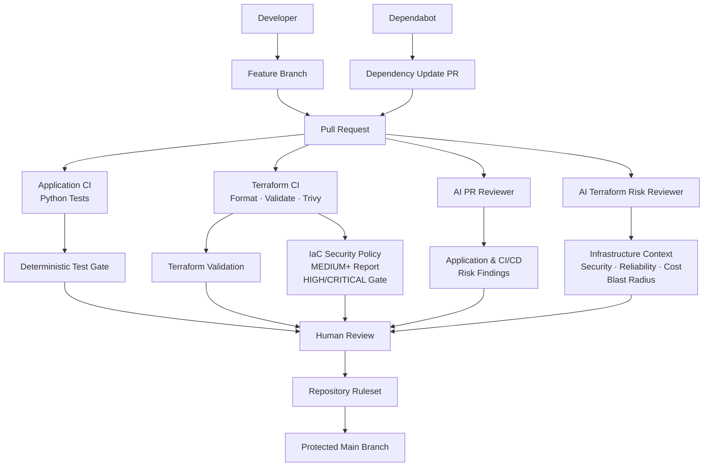
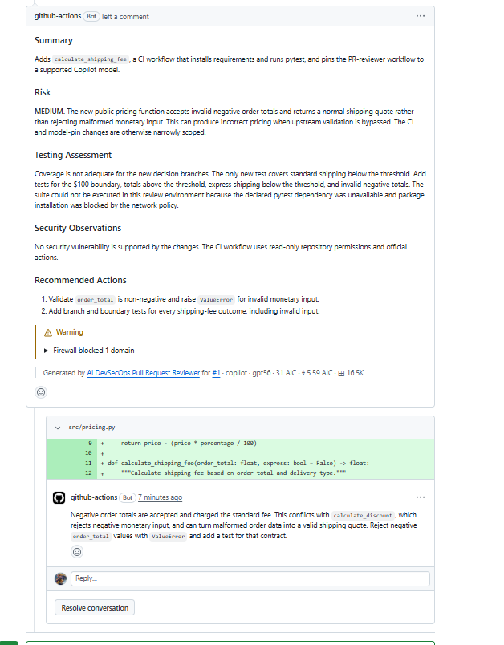
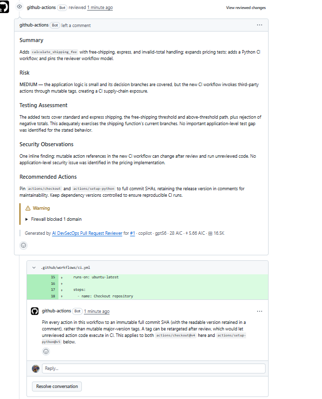
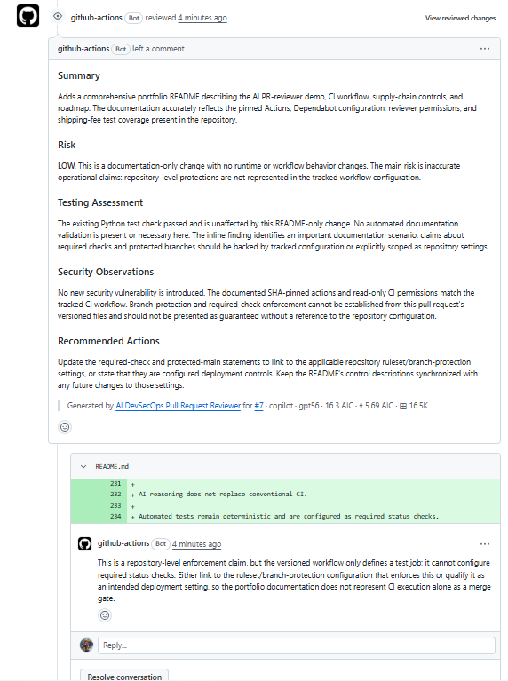
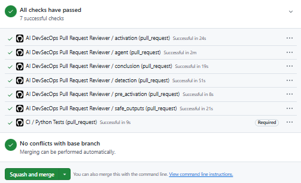
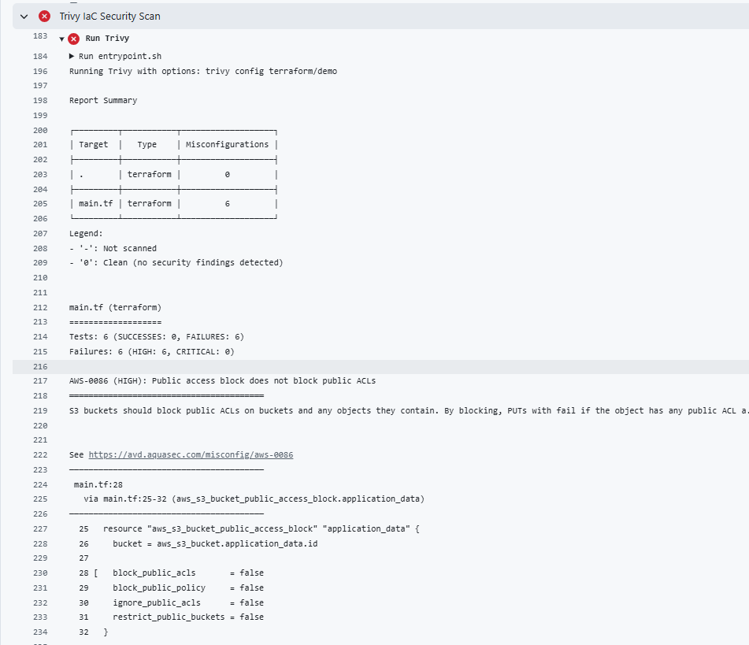
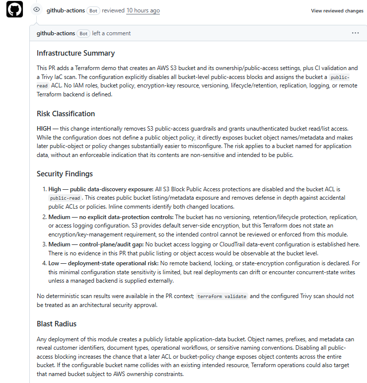
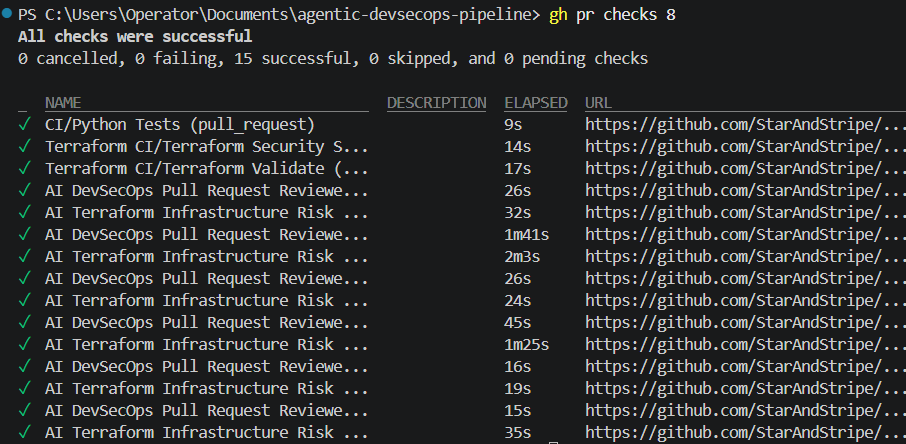
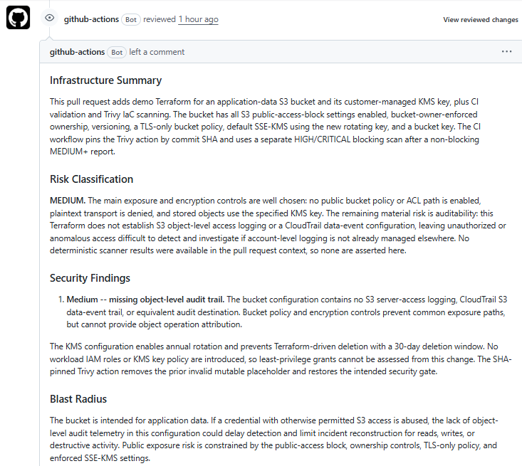

# Agentic DevSecOps Pipeline

> AI-assisted DevSecOps workflows for secure pull request analysis, infrastructure review, and CI/CD investigation.

[](https://github.com/StarAndStripe/agentic-devsecops-pipeline/actions/workflows/ci.yml)

## Overview

The Agentic DevSecOps Pipeline explores how AI agents can augment traditional CI/CD pipelines without replacing deterministic engineering controls.

The project combines:

- GitHub Actions
- GitHub Agentic Workflows
- AI-assisted pull request analysis
- Deterministic automated testing
- Least-privilege permissions
- Safe agent outputs
- Supply-chain hardening
- Dependabot
- Branch protection
- Human-in-the-loop approval

The core engineering principle is:

> **AI reasons → policy constrains → deterministic CI verifies → human decides.**

Rather than giving an AI agent unrestricted control over the software delivery lifecycle, the agent operates as an advisory security and engineering layer around conventional CI/CD controls.

---

## Why This Project?

Traditional CI pipelines are excellent at answering deterministic questions:

- Does the application build?
- Do the tests pass?
- Does linting succeed?
- Does a security scanner detect a known pattern?

However, a successful pipeline does not necessarily mean that a change is well tested, operationally safe, or free from contextual risk.

For example, a test suite may pass while important business edge cases remain completely untested.

This project introduces an AI reasoning layer capable of reviewing the broader context of a change while keeping deterministic CI and human approval authoritative.

---

## Architecture



The deterministic pipeline remains responsible for executing tests and enforcing required checks.

The AI reviewer performs contextual analysis and produces advisory findings.

The human reviewer retains the final merge decision.

---

## Demo 1 — AI-Powered Pull Request Reviewer

### Objective

Build an AI-assisted pull request reviewer capable of identifying risks that may not be detected by deterministic tests alone.

The reviewer analyzes pull request changes for:

- correctness
- missing test coverage
- edge cases
- security concerns
- maintainability
- potential regressions
- CI/CD and supply-chain risks

The agent is intentionally prevented from:

- approving pull requests
- merging code
- modifying source code
- deploying resources
- exposing secrets

Its role is advisory.

---

### Demo Scenario

A shipping-fee function was introduced with logic for:

- standard shipping
- express shipping
- free shipping above a threshold

The initial automated tests passed.

However, the AI reviewer identified that several important behaviors were not adequately covered, including boundary conditions and invalid monetary input.

### First Review

**Risk: MEDIUM**

The reviewer identified:

- insufficient branch coverage
- missing express-shipping tests
- missing free-shipping boundary tests
- missing invalid-order-total validation

The application was updated and the test suite expanded.

The deterministic test suite then reported:

```text
8 passed
```

### Second Review

The functional issues were resolved, but the AI reviewer identified a new DevSecOps concern.

The CI workflow referenced GitHub Actions using mutable major-version tags:

```yaml
uses: actions/checkout@v4
uses: actions/setup-python@v5
```

This introduced a potential software supply-chain risk because mutable tags may change over time.

### Supply-Chain Remediation

The actions were pinned to immutable full commit SHAs:

```yaml
uses: actions/checkout@11d5960a326750d5838078e36cf38b85af677262 # v4.4.0
uses: actions/setup-python@a26af69be951a213d495a4c3e4e4022e16d87065 # v5.6.0
```

Dependabot was then configured to monitor GitHub Actions dependencies and propose controlled updates through pull requests.

### Final Review

**Risk: LOW**

The AI reviewer confirmed:

- application decision branches were covered
- invalid monetary input was handled
- GitHub Actions were pinned to immutable SHAs
- CI retained least-privilege permissions
- no blocking application security issue was identified

All required checks passed before the human-controlled merge.

---

### Evidence & Results

The first demonstration was intentionally developed through multiple review and remediation cycles.

### Review 1 — Application Risk

**AI Risk Assessment: MEDIUM**

The deterministic test suite passed, but the AI reviewer identified missing behavioral coverage:

- express shipping
- free-shipping boundary conditions
- above-threshold behavior
- invalid negative order totals

This demonstrated an important distinction:

> Passing tests prove that tested behavior works. They do not prove that all important behavior has been tested.

### Remediation 1 — Application Tests

Input validation was added and the test suite was expanded to cover the identified decision branches.

```text
8 passed
```

The deterministic CI pipeline subsequently validated the corrected implementation.

### Review 2 — CI/CD Supply-Chain Risk

After the application findings were remediated, the AI reviewer identified a separate DevSecOps concern.

GitHub Actions dependencies used mutable major-version references:

```yaml
uses: actions/checkout@v4
uses: actions/setup-python@v5
```

**AI Risk Assessment: MEDIUM**

The reviewer identified the possibility of tag mutation affecting future CI executions.

### Remediation 2 — Supply-Chain Hardening

The GitHub Actions dependencies were pinned to immutable full commit SHAs.

Dependabot was configured to monitor those dependencies and propose controlled updates through pull requests.

### Review 3 — Final Assessment

**AI Risk Assessment: LOW**

The final review confirmed that:

- application decision branches were covered
- invalid monetary input was rejected
- deterministic tests passed
- GitHub Actions dependencies were immutable
- least-privilege CI permissions were retained
- no blocking application security issue was identified

The pull request was then eligible for human-controlled merge after all required checks passed.

### Outcome

The experiment demonstrated that deterministic CI and contextual AI review can detect different classes of problems.

| Stage | Deterministic CI | AI Review | Finding |
|---|---|---|---|
| Initial change | PASS | MEDIUM | Missing edge cases |
| After test remediation | PASS | MEDIUM | Mutable CI dependencies |
| After supply-chain hardening | PASS | LOW | No blocking finding |

The AI reviewer remained advisory throughout the process. Deterministic controls and human review retained authority over the merge.

### Review Evidence

#### 1. AI reviewer identifies missing application coverage



#### 2. AI reviewer identifies CI/CD supply-chain risk



#### 3. Final AI assessment after remediation



#### 4. Deterministic required checks




---

## Demo 2 — AI Terraform Infrastructure Risk Reviewer

### Objective

Extend the Agentic DevSecOps model from application pull requests to Infrastructure as Code.

This demonstration combines deterministic Terraform validation and IaC security scanning with an AI infrastructure reviewer capable of reasoning about risks that are not necessarily represented by scanner pass/fail results.

The reviewer evaluates Terraform changes for:

- public exposure
- encryption and key management
- IAM and least privilege
- data protection
- infrastructure reliability
- blast radius
- auditability
- operational risks
- cost considerations
- potentially unsafe but technically valid configurations

As with Demo 1, the AI reviewer remains advisory and cannot apply infrastructure changes.

---

### Initial Infrastructure

The demonstration started with an intentionally insecure S3 configuration.

The initial Terraform included:

- disabled S3 public-access protections
- a public-read ACL
- no explicit customer-managed KMS encryption
- no versioning
- no TLS-only bucket policy

Terraform syntax and configuration validation succeeded.

However, deterministic IaC security scanning identified **6 HIGH-severity findings**.

This demonstrated an important distinction:

> Terraform validation proves that infrastructure configuration is structurally valid. It does not prove that the infrastructure is secure.

The AI infrastructure reviewer independently classified the change as HIGH/CRITICAL risk and provided contextual analysis of the potential blast radius.

---

### Remediation 1 — Public Exposure

The S3 configuration was hardened by:

- enabling all S3 public-access-block controls
- removing the public-read ACL
- enabling `BucketOwnerEnforced` ownership
- enabling S3 versioning

After this remediation:

| Control | Result |
|---|---|
| Terraform validation | PASS |
| Trivy HIGH findings | Reduced from 6 to 1 |
| AI infrastructure review | MEDIUM |

The remaining deterministic finding concerned customer-managed encryption key governance.

---

### Remediation 2 — Transport and Encryption

Additional controls were introduced:

- TLS-only S3 bucket policy
- customer-managed AWS KMS key
- SSE-KMS default encryption
- KMS automatic key rotation
- S3 Bucket Key
- 30-day KMS deletion recovery window
- Terraform `prevent_destroy` protection for the KMS key

The S3 bucket policy was also hardened to prevent explicitly requested object encryption from bypassing the designated KMS governance while preserving uploads that rely on bucket default encryption.

At this stage, the deterministic HIGH/CRITICAL security gate passed.

---

### Remediation 3 — IaC Security Policy

The Terraform CI pipeline separates security visibility from blocking policy.

MEDIUM, HIGH, and CRITICAL findings are reported for review:

```yaml
severity: MEDIUM,HIGH,CRITICAL
exit-code: '0'
```

A second deterministic security gate blocks HIGH and CRITICAL findings:

```yaml
severity: HIGH,CRITICAL
exit-code: '1'
```

This creates an explicit security policy:

| Severity | CI Policy |
|---|---|
| LOW | Informational |
| MEDIUM | Visible for review |
| HIGH | Blocking |
| CRITICAL | Blocking |

The Trivy GitHub Action is pinned to an immutable commit SHA as part of the project's software supply-chain controls.

---

### Final Result

The final validation cycle completed with:

```text
0 cancelled
0 failing
15 successful
0 skipped
0 pending
```

Key deterministic results:

- Python application tests: PASS
- Terraform formatting and validation: PASS
- Terraform HIGH/CRITICAL security gate: PASS
- AI PR Reviewer workflow: SUCCESS
- AI Terraform Infrastructure Risk Reviewer workflow: SUCCESS

The AI infrastructure reviewer retained an overall **MEDIUM** risk classification.

Importantly, the remaining findings were not public-exposure or encryption failures. They concerned production architecture decisions such as:

- S3 object-level auditability
- CloudTrail data events
- recovery objectives
- lifecycle and retention strategy
- least-privilege workload IAM/KMS permissions
- production backup and restore requirements

These recommendations were deliberately not implemented automatically.

They require workload context, data classification, RPO/RTO requirements, compliance requirements, cost considerations, and human architectural decisions.

---

### Why MEDIUM With All CI Checks Passing?

This is a deliberate outcome of the experiment.

Deterministic scanners and AI infrastructure reasoning answer different questions.

A deterministic scanner can verify known security policies:

> Is public access blocked?  
> Is encryption configured?  
> Are HIGH or CRITICAL IaC findings present?

The AI reviewer can reason about broader architectural questions:

> How would an operator investigate unauthorized object access?  
> What happens if credentials with legitimate S3 access are compromised?  
> What recovery guarantees does the workload require?  
> Should this workload use immutable retention or replication?

Therefore:

```text
Deterministic CI: PASS
        +
Security Gate: PASS
        +
AI Risk Assessment: MEDIUM
        +
Human Architecture Decision
```

is not a contradiction.

It demonstrates the purpose of the Agentic DevSecOps architecture.

**Passing security gates establish a baseline. AI reasoning identifies contextual risks beyond that baseline. Humans decide which controls are appropriate.**

---

### Demo 2 Outcome

The infrastructure evolved through multiple security review cycles:

| Stage | Terraform Validate | Trivy | AI Review | Primary Finding |
|---|---|---|---|---|
| Initial infrastructure | PASS | 6 HIGH | HIGH/CRITICAL | Public S3 exposure and weak data protection |
| Public-access remediation | PASS | 1 HIGH | MEDIUM | KMS governance |
| KMS/TLS hardening | PASS | PASS | MEDIUM | Architecture and auditability |
| Final policy | PASS | PASS | MEDIUM | Production-context recommendations |

The experiment demonstrates that:

> **Infrastructure can be syntactically valid and scanner-compliant while still requiring architectural security reasoning.**

The AI reviewer remained advisory throughout the process.

No Terraform `apply` is performed by the agent or CI workflow.

Infrastructure deployment authority remains outside the AI agent.

---

### Demo 2 Review Evidence

#### 1. Initial deterministic IaC findings

Terraform validation succeeded, while Trivy identified six HIGH-severity infrastructure findings.



#### 2. Initial contextual infrastructure assessment

The AI infrastructure reviewer independently analyzed the change and identified the broader security and blast-radius implications.



#### 3. Final deterministic validation

After progressive remediation, all 15 GitHub checks completed successfully, including Terraform validation and the HIGH/CRITICAL IaC security gate.



#### 4. Final contextual AI assessment

Despite all deterministic checks passing, the AI reviewer retained a MEDIUM assessment for production-context concerns such as auditability, recovery strategy, lifecycle management, and least-privilege IAM/KMS design.



> **Key result:** Passing deterministic security gates establishes a security baseline; it does not eliminate contextual architectural risk.

---

## Security Model

AI agents operating inside CI/CD environments introduce additional security considerations.

This project therefore applies several controls.

### Least Privilege

The CI workflow uses read-only repository permissions where write access is unnecessary.

```yaml
permissions:
  contents: read
```

The AI reviewer also operates with deliberately restricted permissions.

### Safe Agent Outputs

Agent reasoning is separated from privileged repository operations.

The reviewer can produce controlled outputs such as:

- pull request comments
- inline review comments
- advisory pull request reviews

The agent cannot directly merge or deploy code.

### Human-in-the-Loop

AI findings remain advisory.

A human reviewer evaluates the findings and retains authority over the final merge decision.

### Deterministic Enforcement

AI reasoning does not replace conventional CI.

Automated tests remain deterministic. In the current demonstration repository,
the `Python Tests` job from the `CI` workflow is configured as a required status
check through a GitHub repository ruleset before changes can be merged into `main`.

Repository rulesets are GitHub-side controls and are therefore not represented
by the versioned workflow files in this repository.

### Supply-Chain Hardening

Third-party GitHub Actions are pinned to immutable commit SHAs instead of mutable release tags.

Dependabot provides controlled dependency update proposals.

### Protected Main Branch

In the current demonstration repository, the `main` branch is protected through
a GitHub repository ruleset requiring pull-request-based changes and successful
required CI checks before merge.

Force pushes and branch deletion are restricted.

These protections are repository-level GitHub settings rather than controls
defined directly in the versioned CI workflow.

---

## Deterministic CI vs Agentic Reasoning

| Deterministic CI | Agentic Review |
|---|---|
| Executes tests | Evaluates whether important tests are missing |
| Produces repeatable pass/fail results | Performs contextual reasoning |
| Enforces required checks | Produces advisory findings |
| Validates known conditions | Identifies potential unknown gaps |
| Suitable for hard gates | Suitable for risk assessment |

These approaches are complementary rather than interchangeable.

---

## Technology Stack

### Agentic Engineering

- GitHub Agentic Workflows (`gh-aw`)
- GitHub Copilot
- GPT-5.6 Terra

### CI/CD & DevSecOps

- GitHub Actions
- GitHub Repository Rulesets
- Dependabot
- Trivy IaC Security Scanner

### Infrastructure as Code

- Terraform
- AWS Provider
- Amazon S3
- AWS KMS

### Application Validation

- Python 3.13
- Pytest

---

## Repository Structure

```text
agentic-devsecops-pipeline/
|
|-- .github/
|   |-- aw/
|   |   |-- actions-lock.json
|   |   `-- logs/
|   |
|   |-- skills/
|   |   `-- agentic-workflows/
|   |       `-- SKILL.md
|   |
|   |-- workflows/
|   |   |-- ai-pr-reviewer.md
|   |   |-- ai-pr-reviewer.lock.yml
|   |   |-- ai-terraform-risk-reviewer.md
|   |   |-- ai-terraform-risk-reviewer.lock.yml
|   |   |-- ci.yml
|   |   `-- terraform-ci.yml
|   |
|   `-- dependabot.yml
|
|-- docs/
|   `-- images/
|       |-- 01-ai-review-missing-tests.png
|       |-- 02-ai-review-supply-chain.png
|       |-- 03-ai-review-low-risk.png
|       |-- 04-required-ci-checks.png
|       |-- 05-terraform-trivy-initial.png
|       |-- 06-terraform-ai-initial-risk.png
|       |-- 07-terraform-final-checks.png
|       `-- 08-terraform-final-ai-review.png
|
|-- src/
|   `-- pricing.py
|
|-- terraform/
|   `-- demo/
|       |-- .terraform.lock.hcl
|       |-- main.tf
|       |-- outputs.tf
|       `-- variables.tf
|
|-- tests/
|   `-- test_pricing.py
|
|-- requirements.txt
`-- README.md
```

---

## Current Capabilities

### Demo 1 — AI Pull Request Reviewer

Status: **Completed**

Provides contextual AI-assisted review of application and CI/CD changes while preserving deterministic CI and human merge authority.

### Demo 2 — Terraform Infrastructure Risk Reviewer

Status: **Completed**

Combines Terraform validation, deterministic IaC security scanning, severity-based policy gates, and contextual AI infrastructure review.

Demonstrated capabilities include:

- infrastructure exposure analysis
- encryption and KMS governance
- TLS enforcement
- data-protection analysis
- infrastructure blast-radius reasoning
- reliability and auditability assessment
- cost and operational considerations
- deterministic IaC security gates
- human-controlled architecture decisions

### Demo 3 — CI Failure Investigator

Status: **Planned**

Planned capabilities include:

- CI failure analysis
- probable root-cause identification
- supporting evidence
- remediation recommendations
- confidence assessment

---

## Engineering Principles

This project follows several design principles:

1. AI augments deterministic automation rather than replacing it.
2. Agents receive the minimum permissions required.
3. AI-generated findings are treated as untrusted advisory input.
4. Privileged operations remain policy controlled.
5. Human approval remains part of sensitive decisions.
6. CI/CD dependencies are treated as part of the software supply chain.
7. Agent behavior should be observable, auditable, and reproducible where possible.

---

## Roadmap

- [x] Deterministic Python CI pipeline
- [x] AI-powered pull request reviewer
- [x] Safe agent outputs
- [x] Human-controlled review workflow
- [x] Protected main branch
- [x] Immutable GitHub Action dependencies
- [x] Dependabot for GitHub Actions
- [x] Terraform infrastructure risk reviewer
- [x] Terraform validation pipeline
- [x] Trivy IaC security scanning
- [x] Severity-based IaC policy gates
- [x] S3/KMS security hardening
- [ ] CI failure investigation agent
- [ ] Agent evaluation and observability
- [ ] Multi-model comparison
- [ ] Production-oriented policy gates

---

## Project Status

This repository is an evolving engineering portfolio project focused on the intersection of:

**AI Infrastructure · Agentic DevSecOps · CI/CD · Cloud Security · MLOps**

The goal is to demonstrate practical patterns for introducing AI reasoning into software delivery systems while maintaining security boundaries, deterministic controls, and human oversight.